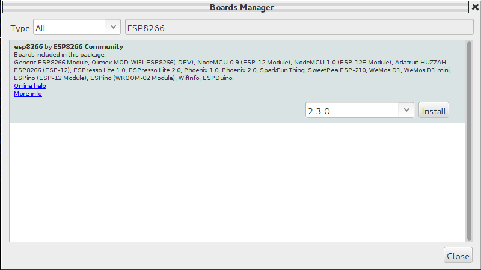

# IoT-Lab: Arduino IDE configuration for use with ESP8266

Now that we have successfully set up the Arduino IDE, we need to install support for the ESP8266 as well as the necessary libraries (e.g. MQTT).

These steps are done in the Arduino IDE and are the same for all platforms.

<!-- MDTOC maxdepth:6 firsth1:2 numbering:0 flatten:0 bullets:1 updateOnSave:1 -->

- [Install ESP8266 support](#install-esp8266-support)   
- [Install MQTT library](#install-mqtt-library)   

<!-- /MDTOC -->

## Install ESP8266 support
Taken From https://github.com/esp8266/Arduino:

  * Start the Arduino-IDE and select `File` > `Preferences` from the menu.
  * Enter `http://arduino.esp8266.com/stable/package_esp8266com_index.json` into the additional board Manager URLs field:

  
  * Open `Boards Manager` from `Tools` > `Board` menu and install `esp8266 by ESP8266 community` (click & select install). In case you encouter an error message at the bottom of the `Boards Manager` like `Error downloading http://downloads.arduino.cc/packages/package_index.json` open a terminal and issue the command `rm ~/Library/Arduino15/package_index.json*` (see [Issue 4623](https://github.com/arduino/Arduino/issues/4623)). Then restart the IDE and try to install the `esp8266 by ESP8266 community` again. This takes a while, since the ESP8266 SDK will be downloaded.
  
  * Select `NodeMCU 1.0 (ESP-12E Platform)` board from `Tools` > `Board` menu after installation to activate compilation for the ESP8266 platform.

## Install MQTT library
We are going to use the [PubSubClient MQTT-Library](http://pubsubclient.knolleary.net), which will be installed using the Library manager of the Arduino IDE:
  * select `Sketch` > `Include Library` > `Manage Libraries ...` to open the library
    Manager.

  * enter `PubSubClient` in the search field and select the entry labeled `PubSubClient by Nick O'Leary`:
  
  * Press `install` to download and install the library

***
Next: [Hello, world!](HelloWorld.md)
